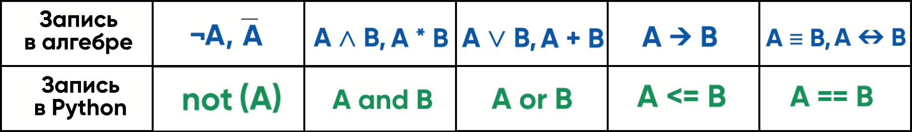
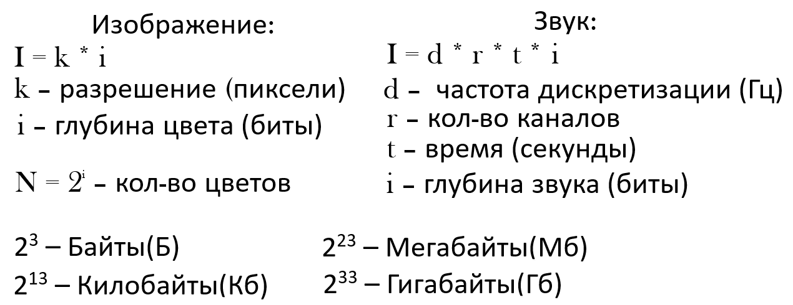
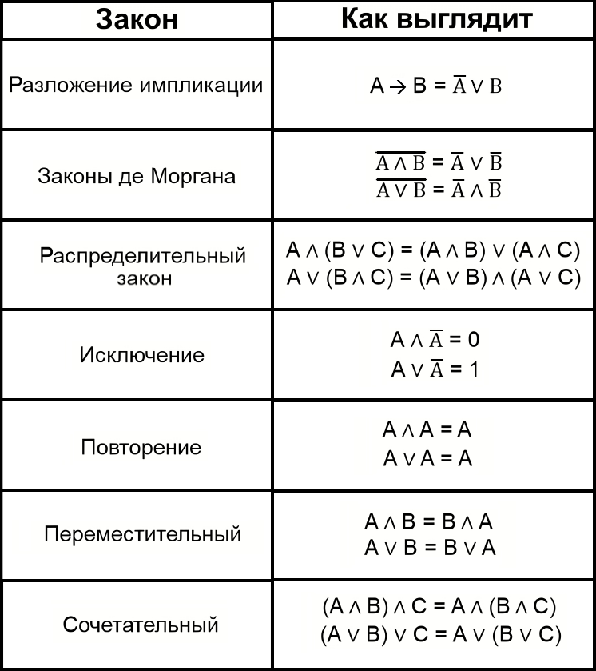

# Теория по Информатике
<a name="navigation"><h2>Навигация</h2></a>

- [Задание 1](#number1)
- [Задание 2](#number2)
- [Задание 3](#number3)
- [Задание 4](#number4)
- [Задание 5](#number5)
- [Задание 6](#number6)
- [Задание 7](#number7)
- [Задание 8](#number8)
- [Задание 9](#number9)
- [Задание 10](#number10)
- [Задание 11](#number11)
- [Задание 12](#number12)
- [Задание 13](#number13)
- [Задание 14](#number14)
- [Задание 15](#number15)
- [Задание 16](#number16)
- [Задание 17](#number17)
- [Задание 18](#number18)
- [Задание 19 | 20 | 21](#number192021)
- [Задание 22](#number22)
- [Задание 23](#number23)
- [Задание 24](#number24)
- [Задание 25](#number25)
- [Задание 26](#number26)
- [Задание 27](#number27)
- [Полезные модули и функции](#usefullFuncs)
- [Модули](#modules)
    - [1. itertools](#itertools)
- [Полезные методы](#usefulMethods)
    - [1. Методы str](#strMethods)
    - [2. Методы list](#listMethods)
    - [3. Методы int](#intMethods)
- [Все нужные функции Exel](#allNeedExelFuncs)
- [Паттерны функций](#FuncPatterns)


<a name="number1">
    <h2>Задание 1(БУ)(3 мин)</h2>
</a>

<h100>[Навигация](#navigation)</h100>

1. Расписываем кол-во соседей для каждой вершины в таблице
2. Ищем уникальные и расписывае
3. Если уникальных нет то берём любую точку и расписываем все возможные варианты
<br>


<a name="number2">
    <h2>Задание 2(БУ)(3 мин)</h2>
</a>

<h100>[Навигация](#navigation)</h100>

- Теория:


**Пример:**
 ```python
 print("x y w z")
for x in range(2):
    for y in range(2):
        for w in range(2):
            for z in range(2):
                p1 = (x<=y)
                p2 = (y==w)
                p3 = (x or z)
                p4 = (p3==w)

                f = ((p1 or p2) and p4)
                if f == 1: print(x, y, w, z)
 ```
 или
 ```python
from itertools import product
print("x y w z")
for x, y, w, z in product(range(2), repeat=4):
    p1 = (x<=y)
    p2 = (y==w)
    p3 = (x or z)
    p4 = (p3==w)

    f = ((p1 or p2) and p4)
    if f == 1: print(x, y, w, z)
 ```
<br>


<a name="number3">
    <h2>Задание 3(БУ)(3 мин)</h2>
</a>

<h100>[Навигация](#navigation)</h100>

```
=впр(ячейка; диапазон; ячейка выводах; 0)

#четвёртый параметр отвечает за приблизительное значение(0-нет, 1-да)
#так как ответ должен ТОЧНЫМ ВСЕГДА 0!!!!!
```
#### Ключевые формулировки:
- **ПРИБЫЛЬ** == сумма(продаж) - сумма(поставок)
- **ВЫРУЧКА** == сумма(проданного)
- на сколько увеличилось кол-во упаковок == СУММА( упаковок поступления ) - СУММА( упаковок продажи )
- сколько килограммов было продано == СУММА(упаковок продаж) * (кол-во в уваковке)
- сколько килограмм поступило == СУММА(упаковок поступление) * (кол-во в упаковке)
- сколько рублей потребовалось магазинам для закупки == СУММА(упаковокпоступление) * (цена/шт)
- сколько рублей выручили магазины от продажи == (кол-во упоковок продаж) * (цена) -->  ***СУММИРОВАТЬ СТОЛБЕЦ***
- определите общую стоимость продусктов, поставленных за указанный период с ..., в магазиниы ... == (кол-во упаковок поступления) * (цена) -->  ***СУММИРОВАТЬ СТОЛБЕЦ***
- определите общий вес (в кг)..., поступившего в магазины == (кол-во упаковок поступления) * (кол-во в упаковке) --> ***СУММИРОВАТЬ СТОЛБЕЦ***
<br>


<a name="number4">
    <h2>Задание 4(БУ)(2 мин)</h2>
</a>

<h100>[Навигация](#navigation)</h100>

<br>


<a name="number5">
    <h2>Задание 5(БУ)(4 мин)</h2>
</a>

<h100>[Навигация](#navigation)</h100>


Руками: - ???
- Перевод в систему счистления
```python
def p(x):
    s =''
    while x!=0:
        s+=str(x%3)
        x//=3
    return s[::-1]
```

**Пример программы:**
```python
def p(x):
    s =''
    while x!=0:
        s+=str(x%3)
        x//=3
    return s[::-1]

def f(x):
    xx = p(x)

    if x%3==0: xx = '1'+xx+'02'
    else: xx+= p((x%3)*4)

    return int(xx, 3)


for n in range(10_000):
    r = f(n)
    if r < 100: print(n)
```
<br>


<a name="number6">
    <h2>Задание 6(БУ)(4 мин)</h2>
</a>

<h100>[Навигация](#navigation)</h100>


Кумир: - ??? \
Python: - ???
<br>


<a name="number7">
    <h2>Задание 7(БУ)(5 мин)</h2>
</a>

<h100>[Навигация](#navigation)</h100>



<br>


<a name="number8">
    <h2>Задание 8(БУ)(4 мин)</h2>
</a>

<h100>[Навигация](#navigation)</h100>


1. Обычный код:
```python
from itertools import product
с = 0
for i in product('КЛЕЙ', repeat=6):  #(алфавит, длина строки)
	i = ''.join(i)  #первращаем tuple в строку
	if i.count('Й') <= 1:  #условие
		if i[0] != 'Й' and i[-1] != 'Й':
			if i.count('ЕЙ')==0 and i.count('ЙЕ')==0:
				c += 1
print(c)
```

2. Условие: не начинакется/заканчивается с гласных/согласных букв:
```python
al ='ДГИАШЭ'; c = 0
for i1 in 'ДГШ':
    for i2 in al:
        for i3 in al:
            for i4 in al:
                for i5 in 'ИАЭ':
                    f=i1+i2+i3+i4+i5
                    c+=1
print(c)
```
<br>


<a name="number9">
    <h2>Задание 9(БУ)(6 мин)</h2>
</a>

<h100>[Навигация](#navigation)</h100>


- Важный момент:
```python
#кол-во чисел без повторов
len(set(ls))
```

**Пример:**
```python
c = 0 #счётчик
for s in open('9.txt'):
    ls=  list(map(int, s.split())) #считываем строку в массив
    lp=[]; ln=[] #массив с повторяющимися; неповторяющимися числами
    for a in ls:
        if ls.count(a)==3: lp.append(a)
        elif ls.count(a)==2: lp.append(a)
        else: ln.append(a)

    if len(set(lp))==2 and len(lp)==5:
        p2 = 1 if max(lp)>max(ln) else 0
        if p2: c+=1
print(c)
```
<br>


<a name="number10">
    <h2>Задание 10(БУ)(3 мин)</h2>
</a>

<h100>[Навигация](#navigation)</h100>


<br>


<a name="number11">
    <h2>Задание 11(ПУ)(3 мин)</h2>
</a>

<h100>[Навигация](#navigation)</h100>


Формулы: - ???
<br>


<a name="number12">
    <h2>Задание 12(ПУ)(6 мин)</h2>
</a>

<h100>[Навигация](#navigation)</h100>


<br>


<a name="number13">
    <h2>Задание 13(ПУ)(3 мин)</h2>
</a>

<h100>[Навигация](#navigation)</h100>


Exel: - ??? \
Код: - ???
<br>


<a name="number14">
    <h2>Задание 14(ПУ)(3 мин)</h2>
</a>

<h100>[Навигация](#navigation)</h100>

#### Функции:
- Взятие алфавита:
```python
from string import *
alphabet = (digits + ascii_uppercase + ascii_lowercase)[:основание]  #строка
#или
alphabet = sorted('0123456789QWERTYUIOPASDFGHJKLZXCVBNMqwertyuiopasdfghjklzxcvbnm')[:основание] #массив
```
- Функция перевода для 3,4,5,6,7,9 системы счисления:
```python
def pere(x):
	s = ''
	while x > 0:
		s += str(x%основание)
		x //= основание
	return s[::-1]
```
- Функция для перевода >10 систему счисления
```python
from string import *
os = 36 #основание
alphabet = (digits + ascii_uppercase + ascii_lowercase)[:os]

def pere(x):
    s=''
    o=36 #основание
    while x>0:
        s+= alphabet[x%o]
        x//= o
    return s[::-1]
```
- Функция для перевода из системы >36:
```python
from string import *
alphabet = (digits + ascii_uppercase + ascii_lowercase)

def todec(x:str): #перевод в 10-тиричную
   x = x[::-1]; os = 42
   ans = 0
   for a in range(0, len(x)):
      ans+= al.index(x[a])*os**a
   return ans
```
- Базовые функции:
```python
xx = bin(x)[2:] #перевод двоичную
xx = oct(x)[2:] #перевод в восмиричную
xx = hex(x)[2:] #перевод в шеснацетиричную

sy = 2 #система счисления
int(x, sy) #переаод из в десятичную из системы счисления<=36
```

#### **Примеры:**
1. База:
```python
al = '0123456789ABC'

for x in al:
    for y in al:
        f = int(f'8{x}78{y}', 13)+ int(f'79{x}{y}7', 18)
        if f%9==0: print(f/9)
```

2. Матеметическое выражение:
```python
#КЕГЭ №23752
from string import *

def pere(x):
   s=''
   while x!=0:
      s+=al[x%27]
      x//=27
   return s[::-1]

c = 0
al = (digits + ascii_uppercase)[:27]

f = 2*2187**2020 + 729**2021 - 2*243**2022\
    + 81**2023 - 2*27**2024 - 6561
f = pere(f)

for i in al[10:]:
   c+= f.count(i)

print(c)
```

3. Система счисления больше 36-ой:
```python
#КЕГЭ №20284
from string import *
al = (digits + ascii_uppercase + ascii_lowercase)

def todec(x:str):
   x = x[::-1]; os = 42
   ans = 0
   for a in range(0, len(x)):
      ans+= al.index(x[a])*os**a
   return ans

for x in digits:
   f1 = todec(f'J569{x}')
   f2 = todec(f'1{x}IA')
   f =f1+f2

   if f%155==0: print(f//155, x)
```
<br>


<a name="number15">
    <h2>Задание 15(ПУ)(3 мин)</h2>
</a>

<h100>[Навигация](#navigation)</h100>

! - Задание 15.4 (ШАБЛОНЫ ПРОГ.pdf) - ???
1. Тип с координатной прямой:

    Алгоритм Ручками:
    1.
    2.
    3.
```python
```
2. Поразрядная конъюнкция:
```python
def f(x, a):
    p1 = x&1097==0
    p2 = x&2047!=0
    p3 = x&a!=0
    return p1 <=(p2 <= p3) # выражение

for a in range(1, 1000):
    #массив со всеми значениями
    s = [f(x, a) for x in range(1, 3000)]
    #all всегда
    if all(s): print(a); break
```
3. Координатная плоскость
```python
#РЕШУ ЕГЭ №13745
def f(x, y):
    p1 = (x<=9)
    p2 = (x*x<=a)
    p3 = (y*y<=a)
    p4 = (y<=9)
    return (p1 <= p2)and(p3<=p4)

r = range(1, 500)
for a in range(1, 500):
    ls = [f(x, y) for x in range(1, 1_000) for y in range(1, 1_000)]
    if all(ls): ans.append(a)

print(max(ans))
```
4. Разное
```python
#КЕГЭ №14658
def ddel(x, xx):
    return x%xx==0

def f(x, a):
    p1 = ddel(x ,12)
    p2 = not(ddel(x, 42))
    p3 = (x+a)>=4096

    return (p1 <= p2) or p3

for a in range(1, 10_000):
    s = [f(x, a) for x in range(1, 10_000)]

    if all(s): print(a);break
```
```python
#КЕГЭ №1345
def f(x):
    p1 = not(x%3==0)
    p2 = x not in [48, 52, 56]
    p3 = abs(x-50)<=7
    p4 = 29<=x<=47
    p5 = x&a==0

    return ((p1 and p2) <= (p3<=p4) or p5)

for a in range(1, 1_000):
    s = [f(x) for x in range(1, 1_000)]
    if all(s): print(a); break
```
```python
#КЕГЭ №5368
def pod(n, m):
    return n%m==0

def f(x):
    p1 =pod(x, 17)
    p2 = not(pod(x, 53))
    p3 = not(a<90_000_000-x)

    return ((p1 <= p2) or p3)

for a in range(90_000_000, 1, -1):
    s = [f(x) for x in range(1, 100_000)]
    if all(s): print(a)
```
<br>


<a name="number16">
    <h2>Задание 16(ПУ)(5 мин)</h2>
</a>

<h100>[Навигация](#navigation)</h100>

1. Просто переписать:
```python
from sys import setrecursionlimit
setrecursionlimit(10000) #лимит рекурсии

def f(n):
    if n<20: return n
    else: return (n-6)*f(n-7)

print((f(47872)-290*f(47865))/f(47858))
```

2. Через lru_cache:
 ```python
 #РЕШУ ЕГЭ №76713
from functools import lru_cache
from sys import setrecursionlimit
setrecursionlimit(10000)

@lru_cache(None) #кэширует результаты рекурсии
def f(n):
    if n ==0: return 0
    if n>0 and n%2==0: return f(n//10)+n%10
    else: return f(n//10)

c=0
for n in range(4*10**7, 9*10**7 + 1):
    s = f(n)
    if s == 0: c+=1
print(c)
 ```

3. Универсальный, через массивы:
```python
ls = [0]*2040  #заполняем массив до наших значений нулями для того, чтоб существовали индексы

for n in range(2025, len(ls)): #перезаписываем индексы после 2025
	f[n] = 1  #команда в задании при опр условии

for n in range(2024, -1, -1):  #перезаписываем индексы от 2024 до -1 (чтоб 0 тоже был)
	f[n] = n-f[n+2]-f[n+4]  #команда в задании при опр условии

print(f[20]+f[25])  #выводим ответ
```
<br>


<a name="number17">
    <h2>Задание 17(ПУ)(14 мин)</h2>
</a>

<h100>[Навигация](#navigation)</h100>

- Важный момент:
```python
ls = [int(x) for x in open("17.txt")] #чтение файла

#два идущих подряд элемента последовательности
for x in range(len(ls)-1):
    s = [ls[i], ls[i+1]]

#два различных элемента последовательности
for x in range(len(ls)-1):
	for y in range(x+1, len(ls)):
		s = [ls[x], ls[y]]
```
<br>

**Пример программы**:
```python
ls = [int(x) for x in open("23757.txt")]
pre = 100_001; c = 0; ma = -1

for a in ls:
    if a > 9 and a < 100:
        pre = min(pre, a)

for i in range(len(ls)-1):
    s = ls[i:i+2]
    cc = 0

    for a in s:
        if a > 9 and a < 100: cc+=1

    if cc ==1 and sum(s)%pre==0:
        c+=1; ma = max(ma, sum(s))

print(c, ma)
```
<br>


<a name="number18">
    <h2>## Задание 18(ПУ)(8 мин)</h2>
</a>

<h100>[Навигация](#navigation)</h100>

<br>


<a name="number192021">
    <h2>Задание 19 | 20 | 21 (БУ | ПУ | ВУ) (6 | 8 |11 мин)</h2>
</a>

<h100>[Навигация](#navigation)</h100>

1. одна куча камней:
```python
def f(s "stones", m "moves"):
    if s<>"условие выйгрыша": return m%2==0
    if m == 0: return 0
    #ходы для каждой кучи
    h = [f(s-+"ход1", m-1), f(s-+"ход2",m-1), f(s-+"ход3", m-1)]
    return any(h) if m%2!=0 else all(h)

r = range("камни в начальный момент")
print('19)', [s for s in r if f(s,2)])
print('20)', [s for s in r if (not(f(s,1)) and f(s,3))])
print('21)', [s for s in r if (not(f(s,2)) and  f(s,4))])
```

2. две кучи камней:
```python
def f(a "куча 1", b "куча 1", m "moves"):
    if a+b<>"условие выйгрыша": return m%2==0
    if m == 0: return 0
    #ходы для каждой кучи
    h = [f(a+1, b, m-1), f(a, b+1, m-1), f(a*2, b, m-1), f(a, b*2, m-1)]
    return any(h) if m%2!=0 else all(h)

c = 2 #в первой куче
r = range("камни в начальный момент")
print('19)', [s for s in r if f(с, s, 2)])
print('20)', [s for s in r if (not(f(с, s, 1)) and f(с, s, 3))])
print('21)', [s for s in r if (not(f(с, s, 2)) and f(с, s, 4))])
```

- !!! при неудачном ходе:
```python
#поледний return меняется ТОЛЬКО для номера с неудачным ходом
return any(h) if m%2!=0 else any(h)
```
- !!! Если условие пройгрыша:
```python
return all(h) if m%2!=0 else any(h)
#и в условиях ответа идём от обратного
```

<br>


<a name="number22">
    <h2>Задание 22(ПУ)(7 мин)</h2>
</a>

<h100>[Навигация](#navigation)</h100>

<br>


<a name="number23">
    <h2>Задание 23(ПУ)(8 мин)</h2>
</a>

<h100>[Навигация](#navigation)</h100>

Шаблон:
```python
from sys import setrecursionlimit
setrecursionlimit(5000)

def f(x: int, y: int):
	if x>y: return 0     #обязательно
	if x == y: return 1  #обязательно
	if x == 'избегающее число': return 0
	if x<y: return f(x+1, y) + f(2*x+1, y) #складывание вариантов f(команда_испольнителя ,y)

    print(f('начальное_число', 'обязательное_число') * f('обязательное_число', 'конечное_число'))

```
<br>

<a name="number24">
    <h2>Задание 24(ВУ)(18 мин)</h2>
</a>

<h100>[Навигация](#navigation)</h100>

1. Метод вложенный циклов:
```python
m = 0
for l in range(len(s)): #левая граница
    for r in range(l+m, len(s)): #правая граница
        c = s[l:r+1] #срез по границам
```
```python
s = open('1.txt').readline()

m = 0
for l in range(len(s)):
    for r in range(l+m, len(s)):
        c = s[l:r+1]

        if c.count('C')>2 or c.count('D')>2: #условие для оптимизации
            break
        if c.count('C')<=2 and c.count('D')<=2: #условие задания
            m = max(m, len(c))

print(m)
```
2. Метод вложенный циклов (для минимума):
```python
m = 1000 #начальное число
for l in range(len(s)):
    for r in range(l+m, l, -1):
        c = s[l:r+1]
```
```python
s = open('24_9169.txt').readline()

m = 1000 #начальное число
for l in range(len(s)):
    for r in range(l+m, l, -1):
        c = s[l:r+1]

        if (c.count("BAD")+c.count("FAT"))>3:
            break
        if (c.count("BAD")+c.count("FAT"))==3:
            m = min(m, len(c))
print(m)
```
3. Регулярки
```python
```

<a name="number25">
    <h2>Задание 25(ВУ)(20 мин)</h2>
</a>

<h100>[Навигация](#navigation)</h100>

- Фукция нахождения простого числа:
```python
def is_prime(x):
	if x <= 1: return False
	for i in range(2, int(x**0.5) + 1):
		if x % i == 0:
			return False
    return True
```
- Фукция нахождения множества делителей
```python
def dels(x):
	se = set()
	for i in range(1, int(x**0.5)+1):
		if x%i==0:
            se.add(i)
            se.add(x//i)
	return se
```

#### **Примеры:**
1. База:
```python
from fnmatch import fnmatch

for i in range(0, 10**10, 'число на которое должно делиться'):
	if fnmatch(str(i), "переписанная маска"):
		print(i, i//'число на которое должно делиться')

```
2. Сложно - ???
```
# Дописать
```
<br>


<a name="number26">
    <h2>Задание 26(ВУ)(35 мин)</h2>
</a>

<h100>[Навигация](#navigation)</h100>

<br>


<a name="number27">
    <h2>Задание 27(ВУ)(40 мин)</h2>
</a>

<h100>[Навигация](#navigation)</h100>

<br>


<a name="usefullFuncs">
    <h1>Полезные модули и функции</h1>
</a>

<h100>[Навигация](#navigation)</h100>

1. setrecursionlimit() - задаёт ручной лимит рекурсии
```python
from sys import setrecursionlimit
setrecursionlimit(10_000) # нельзя устанавливать слишком большое значение
						  # тк есть ограничения операционной системы
```
2. lru_cache - декоратор, который сохраняет значения функции и их не надо считать второй раз, что ускоряет работу
```python
from functools import lru_cache

@lru_cache(None)
def f(n):
	if n == 1: return 1
	if n > 1: return f(n - 1) - 2*g(n - 1)
```
>    Следует использовать когда:
>    - Функции, которые выполняются многократно или долго.
>    - Функции, которые часто вызываются с одними и теми же аргументами.
>    - Функции, которые требуют больших вычислительных затрат.
3. алфавит из string
```python
from string import *

end = 16 #система счисления 16
s = (digits + ascii_uppercase + ascii_uppercase)[:end]
# s - алфавит с основанием 16
```
>1. digits - все числа
>2. ascii_uppercase - все заглавные буквы
>3. ascii_lowercase - все строчные буквы
4. enumerate - добавляет автоматический счётчик к елементам, возвращая пару число, значение
```python
numbs = [150, 160, 170]
for index, num in enumerate(numbs, 2):
    print(f"{index}. {num}")
```
> 2. 150
> 3. 160
> 4. 170

<br><br>


<a name="modules">
    <h1>Модули</h1>
</a>

<h100>[Навигация](#navigation)</h100>

<a name="itertools">
    <h2>1. itertools</h2>
</a>

1. **product**(алфавит, repeat=длина строки) - для перебора
```python
for i in product("01234567", repeat=5):
	print(i__class__) #tuple с симолами

	i = i.''join(i)
	print(i.__class__) #строка
```
2. **combinations** - ???
3. **permutations** - ???


<a name="usefulMethods">
    <h1>Полезные методы</h1>
</a>

<h100>[Навигация](#navigation)</h100>

<a name="strMethods">
    <h2>1. Методы str</h2>
</a>

|метод|что делает|
|---|------------|
|s.count('подстрока')|выводит кол-во подстрок в строке|
|s.replace('что заменить', 'на что заменмить', сколько раз)|заменяет символы в строке|
|s.split('параметр')|возвращает массив со строками рабитые по параметру|
|s.index('подстрока')|выводит первый индекс подстроки|
|s.find('подстрока')|выводит первый индекс в стороке|
|s.strip()|убирает пробелы в начале и конце строки|
|s.islower() <br> s.isupper()|проверяет чтоб все символы в строке были строчными <br> проверяет чтоб все символы в строке были заглавными|
|s.lower() <br> s.upper()|превращает все символы в строчные <br> превращает все символы в заглавные|
|s.swapcase()|меняет (все ЗГЛАВНЫЕ на строчные) и (все строчные на ЗАГЛАВНЫЕ)|

<br>

<a name="listMethods">
    <h2>2. Методы list</h2>
</a>

|метод|что делает|
|---|------------|
|ls.append(a) <br> a += [15]|добавляет в список элемент|
|ls.insert(in, a)|добасляет объект на опр индекс|
|ls.remove(a)|удаляет первый по эл a|
|ls.pop(in)|удаляет эл по индексу|
|ls.sort() <br> ls1 = sorted(ls)|сортирует список|
|ls.sort(reverse=True) <br> ls1 = sorted(ls)[::-1]|сортирует списк по убыванию|
|ls.index(a)|индекс первого эл a|

<br>

<a name="intMethods">
    <h2>3. Методы int</h2>
</a>

|метод|что делает|
|---|------------|
|i.\_\_ceil\_\_()|Округляет число в большую сторону|
|i.\_\_floor\_\_()|Округляет число в меньшую сторону|

<br>

<a name="allNeedExelFuncs">
    <h1>Все нужные функции Exel</h1>
</a>

<h100>[Навигация](#navigation)</h100>

|функция|что делает|
|-----|---------------|
|МИН(число) <br> МАКС(число)|Мин значение <br> Макс значение|
|ЕСЛИ(условие, если да, если нет)|обычное условие|
|И() <br> ИЛИ()|Обычные функции и / или|
|СУММ(диапозон) <br> СУММЕСЛИ(диапозон; условие)|Сумма значений в списке <br> Сумма значений в списке при выполнении условия|
|СЧЁТ(диапозон) <br> СЧЁТЕСЛИ(диапозон; условие)|Подсчёт элементов в списке <br> Подсчёт элементов в списке при выполнении условия|
|СРЗНАЧ(диапозон) <br> СРЗНАЧЕСЛИ(диапозон; условие)|Среднее арифметическое чисел <br> Среднее арифметическое чисел при выполнении условия|
|НАИБОЛЬШИЙ(диапозон; по счёту(k)) <br> НИМЕНЬШИЙ(диапозон; по счёту(k))|Возвращает k-ое наибольшее число из списка <br> Возвращает k-ое наименьшее число из списка (k – аргумент)|
|ЕЧЁТН(число) <br> ЕНЕЧЁТ(число)|ИСТИНА, если число четное, иначе ЛОЖЬ <br> ИСТИНА, если число нечётное, иначе ЛОЖЬ|
|ОСТАТ(число; делитель)|Остаток при делении числа на второй аргумент|
|ЦЕЛОЕ(число)|Берёт только целую часть числа|
|ОКРУГЛВВЕРХ(число, разряды) <br> ОКРУГЛВНИЗ(число, разряды)|Округляет число в большую сторону до k-ого разряда <br> Округляет число в меньшую сторону до k-ого разряда|
|ВПР(клетка; диапазон; клетка вывода; 0)|Ищет совпадения в левом крайнем столбце таблицы и <br> возвращает значение из указанного столбца той же строки|


<a name="FuncPatterns">
    <h1>Паттерны функций</h1>
</a>

<h100>[Навигация](#navigation)</h100>

- Функция перевода для 3,4,5,6,7,9 системы счисления:
```python
def pere(x):
	s = ''
	while x > 0:
		s += str(x%основание)
		x //= основание
	return s[::-1]
```
- Функция перевода в систему счисления >10:
```python
from string import *
alphabet = digits + ascii_uppercase + ascii_lowercase

def pere(x):
    s=''
    while x>0:
        s+= alphabet[x%основание]
        x//= основание
    return s[::-1]
```
- Функция перевода в 10-тиричную систему:
```python
from string import *
alphabet = (digits + ascii_uppercase + ascii_lowercase)

int(x, основание) #для с основанием 36<=
def todec(x:str): #для с основанием >36
   x = x[::-1]; os = 42
   ans = 0
   for a in range(0, len(x)):
      ans+= al.index(x[a])*os**a
   return ans
```
- Функция нахождения простого числа:
```python
def is_prime(x):
	if x <= 1: return False

	for i in range(2, int(x**0.5) + 1):
		if x % i == 0:
			return False
    return True
```

- Функция нахождения множества делителей
```python
def dels(x):
	se = set()
	for i in range(1, int(x**0.5)+1):
		se.add(i); se.add(x//i)
	return mn
```

- Проверка на полный квадрат:
```python
def f(x):
	if x>=0 and x**0.5%1==0:
		return True
```
